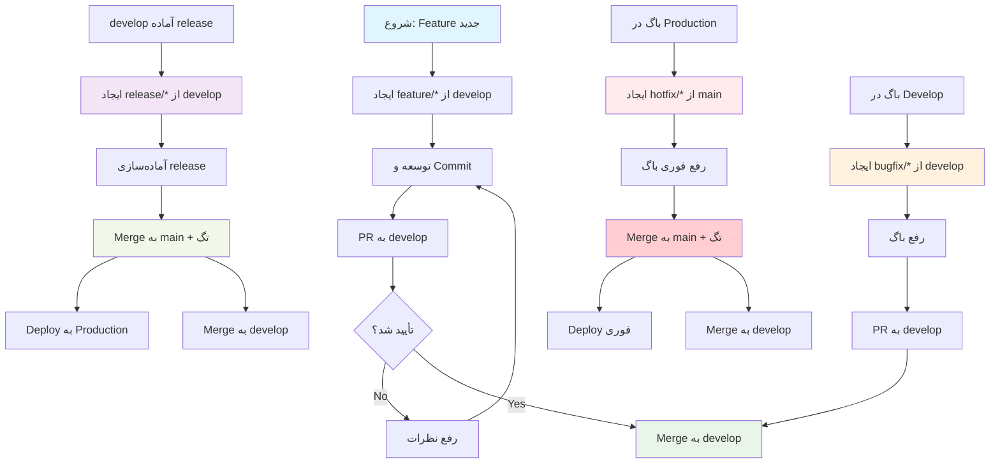

# 🔄 راهنمای کامل Git Flow برای پروژه KhodroBan

## 📋 مقدمه

با توجه به اهمیت **پایداری (stability)** در پروژه KhodroBan، تصمیم گرفتیم از **مدل Git Flow** استفاده کنیم. این مدل با جداسازی clear بین محیط‌های توسعه، staging و production، پایداری کد production را تضمین می‌کند.

---

## 🏗️ ساختار برنچ‌ها در Git Flow

```
main                     # نسخه production (همیشه stable)
└── develop              # نسخه integration (آماده‌سازی برای release بعدی)
    ├── feature/*       # توسعه قابلیت‌های جدید
    ├── bugfix/*        # رفع باگ‌های محیط توسعه
    ├── release/*       # آماده‌سازی release
    └── hotfix/*        # رفع باگ‌های فوری در production
```

---

## 📊 جدول چرخه حیات کامل هر نوع برنچ

| نوع برنچ   | ایجاد از | ادغام به               | هدف                                              | طول عمر معمول |
| ----------------- | --------------- | ----------------------------- | --------------------------------------------------- | ------------------------ |
| **Feature** | `develop`     | `develop`                   | توسعه قابلیت جدید                    | ۱-۳ روز             |
| **Bugfix**  | `develop`     | `develop`                   | رفع باگ در محیط توسعه              | ۱-۲ روز             |
| **Release** | `develop`     | `main` + `develop` + تگ | آماده‌سازی نسخه برای انتشار | ۱-۷ روز             |
| **Hotfix**  | `main`        | `main` + `develop` + تگ | رفع باگ فوری در production              | چند ساعت          |

---

## 🔄 **چرخه کامل هر نوع برنچ با مثال‌های عملی**

### **۱. Feature Branch (توسعه قابلیت جدید)**

#### **هدف:**

- توسعه یک قابلیت جدید که در release بعدی منتشر خواهد شد
- عدم تأثیر بر کد production

#### **چرخه کامل:**

**مرحله ۱: ایجاد از develop**

```bash
# اطمینان از به‌روز بودن develop
git checkout develop
git pull origin develop

# ایجاد برنچ feature جدید
git checkout -b feature/user-authentication

# یا با نام‌گذاری پیشرفته‌تر (شامل issue number)
git checkout -b feature/123-user-auth
```

**مرحله ۲: توسعه و commit**

```bash
# توسعه feature
# ...

# commit کردن تغییرات (چند commit کوچک)
git add frontend/src/auth/
git commit -m "feat(auth): اضافه کردن صفحه لاگین"

git add backend/src/auth/
git commit -m "feat(auth): پیاده‌سازی API احراز هویت"

git add docs/auth.md
git commit -m "docs: به‌روزرسانی مستندات احراز هویت"

# push به remote
git push -u origin feature/user-authentication
```

**مرحله ۳: بررسی کد (Code Review)**

```bash
# ایجاد Pull Request به develop از GitHub/GitLab
# عنوان PR: "feat: اضافه کردن سیستم احراز هویت"
# توضیحات کامل شامل:
# - هدف feature
# - تغییرات انجام شده
# - تست‌های اجرا شده
# - اسکرین‌شات (اگر UI تغییر کرده)
```

**مرحله ۴: ادغام به develop**

```bash
# بعد از approve شدن PR، آن را merge کنید
# روش پیشنهادی: "Squash and Merge" برای تاریخچه تمیز

# یا از command line:
git checkout develop
git pull origin develop
git merge --squash feature/user-authentication
git commit -m "feat: اضافه کردن سیستم احراز هویت کامل

- صفحه لاگین در frontend
- API احراز هویت در backend
- مستندات کامل

Closes #123"
git push origin develop
```


وقتی می‌خوای دو برنچ رو با هم merge کنی:

فرض کن دو تا برنچ داری:

- `main` (یا `master`)
- `feature/login`

### مهم‌ترین قانون merge در گیت:

> **برنچی که الان توش هستی (current branch)**، مقصد ادغام می‌شود.
> برنچی که اسمش رو می‌نویسی، منبع ادغام می‌شود (یعنی تغییراتش میاد داخل برنچ فعلی).

### مثال‌های رایج و واضح

#### حالت ۱: می‌خوای تغییرات branch2 رو بیاری توی branch1

```bash
# اول مطمئن شو که توی branch1 هستی
git checkout branch1

# حالا branch2 رو توی branch1 ادغام کن
git merge branch2
```

**نتیجه:**

- تغییرات branch2 میاد داخل branch1
- branch2 هیچ تغییری نمی‌کنه
- branch1 حالا شامل هر دو مجموعه تغییرات است

#### حالت ۲: می‌خوای branch1 رو توی main ادغام کنی (رایج‌ترین حالت)

```bash
# برو به برنچ اصلی (مقصد)
git checkout main

# حالا برنچ فیچر رو ادغام کن
git merge feature/login
```

**نتیجه:**

- تغییرات `feature/login` میاد داخل `main`
- `feature/login` دست‌نخورده می‌مونه
- `main` به‌روز می‌شود

### خلاصه به زبان خیلی ساده

| کاری که می‌خوای انجام بدی   | دستوری که باید بزنی                     | نتیجه نهایی                                     |
| ------------------------------------------------ | ------------------------------------------------------- | --------------------------------------------------------- |
| تغییرات branch2 بیاد توی branch1   | `git checkout branch1` `<br>` `git merge branch2` | branch1 ← تغییرات branch2 اضافه می‌شود |
| تغییرات feature رو بیار توی main | `git checkout main` `<br>` `git merge feature`    | main ← تغییرات feature اضافه می‌شود    |
| تغییرات dev رو بیار توی main     | `git checkout main` `<br>` `git merge dev`        | main به‌روز می‌شود                            |

### ترتیب پیشنهادی (بهترین روش)

1. اول برو به برنچی که **می‌خوای تغییرات بهش اضافه بشه**

   ```bash
   git checkout main
   ```
2. مطمئن شو که آخرین تغییرات رو کشیدی

   ```bash
   git pull
   ```
3. حالا برنچ مورد نظرت رو merge کن

   ```bash
   git merge feature-xyz
   ```
4. اگر مشکلی پیش نیومد، push کن

   ```bash
   git push
   ```

موفق باشی!
اگر بازم سوالی داشتی یا conflict پیش اومد، بگو دقیق راهنمایی کنم.


**مرحله ۵: پاک‌سازی**

```bash
# حذف برنچ محلی
git branch -d feature/user-authentication

# حذف برنچ remote
git push origin --delete feature/user-authentication
```

#### **📝 مثال عملی:**

فرض کنید می‌خواهید feature "مدیریت خودروها" را اضافه کنید:

```bash
# شروع
git checkout develop
git pull origin develop
git checkout -b feature/vehicle-management

# توسعه
# ۱. اضافه کردن API خودروها در backend
git add backend/src/vehicles/
git commit -m "feat(vehicles): اضافه کردن API CRUD خودروها"

# ۲. اضافه کردن صفحه مدیریت خودروها در frontend
git add frontend/src/views/vehicles/
git commit -m "feat(vehicles): اضافه کردن صفحه مدیریت خودروها"

# ۳. اضافه کردن تست‌ها
git add backend/tests/test_vehicles.py
git add frontend/tests/vehicles.test.js
git commit -m "test: اضافه کردن تست‌های مدیریت خودروها"

# ۴. push و ایجاد PR
git push -u origin feature/vehicle-management
# ایجاد PR به develop
```

---

### **۲. Bugfix Branch (رفع باگ در محیط توسعه)**

#### **هدف:**

- رفع باگ‌هایی که در محیط توسعه یا staging کشف شده‌اند
- این باگ‌ها هنوز به production نرسیده‌اند

#### **چرخه کامل:**

**مرحله ۱: ایجاد از develop**

```bash
git checkout develop
git pull origin develop
git checkout -b bugfix/login-validation-error
```

**مرحله ۲: رفع باگ و commit**

```bash
# رفع مشکل validation در صفحه لاگین
git add frontend/src/auth/LoginForm.vue
git commit -m "fix(auth): رفع مشکل validation ایمیل در صفحه لاگین

- اصلاح regex validation ایمیل
- اضافه کردن پیام خطای مناسب
- تست‌های واحد به‌روزرسانی شده"

# push به remote
git push -u origin bugfix/login-validation-error
```

**مرحله ۳: بررسی کد و ادغام**

```bash
# ایجاد PR به develop
# عنوان: "fix: رفع مشکل validation ایمیل در لاگین"
# بعد از approve شدن، merge به develop
```

**مرحله ۴: پاک‌سازی**

```bash
git branch -d bugfix/login-validation-error
git push origin --delete bugfix/login-validation-error
```

#### **📝 مثال عملی:**

باگ: کاربران با ایمیل‌های دارای underline (`_`) نمی‌توانند لاگین کنند.

```bash
# ایجاد برنچ
git checkout develop
git checkout -b bugfix/email-validation-underscore

# رفع باگ
# اصلاح فایل validation در frontend
git add frontend/src/utils/validators.js
git commit -m "fix(validation): پشتیبانی از underscore در validation ایمیل

- به‌روزرسانی regex validation
- اضافه کردن تست برای ایمیل‌های با underscore
- اصلاح پیام خطا"

# ایجاد PR به develop
```

---

### **۳. Release Branch (آماده‌سازی برای انتشار)**

#### **هدف:**

- آماده‌سازی نهایی یک نسخه برای انتشار
- انجام کارهای final قبل از رفتن به production
- اجازه دادن به ادامه توسعه در develop

#### **چرخه کامل:**

**مرحله ۱: ایجاد از develop (وقتی develop برای release آماده است)**

```bash
git checkout develop
git pull origin develop
git checkout -b release/v1.2.0
```

**مرحله ۲: آماده‌سازی release**

```bash
# ۱. به‌روزرسانی version numbers
git add package.json pyproject.toml
git commit -m "chore: به‌روزرسانی version به ۱.۲.۰"

# ۲. به‌روزرسانی changelog
git add CHANGELOG.md
git commit -m "docs: به‌روزرسانی changelog برای نسخه ۱.۲.۰"

# ۳. انجام تست‌های نهایی
# ۴. رفع باگ‌های آخر (فقط criticalها)

# push به remote
git push -u origin release/v1.2.0
```

**مرحله ۳: ادغام به main (ایجاد release)**

```bash
# ۱. Merge به main
git checkout main
git pull origin main
git merge --no-ff release/v1.2.0

# ۲. ایجاد تگ version
git tag -a v1.2.0 -m "Release version 1.2.0
- اضافه شدن سیستم احراز هویت
- صفحه مدیریت خودروها
- بهبود performance"

# ۳. Push تگ
git push origin v1.2.0
git push origin main
```

**مرحله ۴: ادغام به develop (همگام‌سازی)**

```bash
# ۱. Merge تغییرات release به develop
git checkout develop
git pull origin develop
git merge --no-ff release/v1.2.0

# ۲. Push develop
git push origin develop
```

**مرحله ۵: پاک‌سازی**

```bash
git branch -d release/v1.2.0
git push origin --delete release/v1.2.0
```

#### **📝 مثال عملی:**

آماده‌سازی release نسخه ۱.۳.۰:

```bash
# ایجاد برنچ release
git checkout develop
git checkout -b release/v1.3.0

# آماده‌سازی
# ۱. به‌روزرسانی version
echo '{"version": "1.3.0"}' > version.json
git add version.json
git commit -m "chore: افزایش version به ۱.۳.۰"

# ۲. نهایی کردن changelog
cat > CHANGELOG.md << EOF
# Changelog

## [1.3.0] - 2024-03-15
### Added
- سیستم اطلاع‌رسانی
- گزارش‌های پیشرفته
- اکسپورت داده‌ها به Excel

### Fixed
- مشکل performance در لیست خودروها
- باگ نمایش تاریخ در موبایل
EOF
git add CHANGELOG.md
git commit -m "docs: به‌روزرسانی changelog برای v1.3.0"

# ۳. ادغام به main و ایجاد تگ
git checkout main
git merge --no-ff release/v1.3.0
git tag -a v1.3.0 -m "Release v1.3.0: سیستم اطلاع‌رسانی و گزارش‌ها"
git push origin main v1.3.0

# ۴. ادغام به develop
git checkout develop
git merge --no-ff release/v1.3.0
git push origin develop

# ۵. پاک‌سازی
git branch -d release/v1.3.0
```

---

### **۴. Hotfix Branch (رفع باگ فوری در production)**

#### **هدف:**

- رفع باگ‌های critical در production
- بدون انتظار برای release بعدی
- اعمال فوری روی production

#### **چرخه کامل:**

**مرحله ۱: ایجاد از main (⚠️ نه از develop!)**

```bash
git checkout main
git pull origin main
git checkout -b hotfix/security-vulnerability
```

**مرحله ۲: رفع باگ و commit**

```bash
# رفع آسیب‌پذیری امنیتی
git add backend/src/auth/security.py
git commit -m "fix(security): رفع آسیب‌پذیری XSS در فیلد جستجو

- sanitize کردن input کاربر
- اضافه کردن validation اضافی
- به‌روزرسانی dependencyهای امنیتی"

# push به remote
git push -u origin hotfix/security-vulnerability
```

**مرحله ۳: ادغام به main (برای deploy فوری)**

```bash
# ۱. Merge به main
git checkout main
git pull origin main
git merge --no-ff hotfix/security-vulnerability

# ۲. ایجاد تگ hotfix
git tag -a v1.2.1 -m "Hotfix v1.2.1: رفع آسیب‌پذیری XSS"

# ۳. Deploy فوری به production
git push origin main
git push origin v1.2.1
```

**مرحله ۴: ادغام به develop (همگام‌سازی)**

```bash
# ۱. Merge به develop
git checkout develop
git pull origin develop
git merge --no-ff hotfix/security-vulnerability

# ممکن است نیاز به resolve conflict باشد
# ...

# ۲. Push develop
git push origin develop
```

**مرحله ۵: پاک‌سازی**

```bash
git branch -d hotfix/security-vulnerability
git push origin --delete hotfix/security-vulnerability
```

#### **📝 مثال عملی:**

باگ critical: API در معرض SQL Injection قرار دارد.

```bash
# ایجاد hotfix از main
git checkout main
git checkout -b hotfix/sql-injection-fix

# رفع باگ
# اصلاح query‌های database
git add backend/src/database/queries.py
git commit -m "fix(security): رفع آسیب‌پذیری SQL Injection در API جستجو

- استفاده از parameterized queries
- حذف string concatenation در SQL
- اضافه کردن تست‌های امنیتی"

# ادغام فوری به main
git checkout main
git merge --no-ff hotfix/sql-injection-fix
git tag -a v1.0.1 -m "Hotfix: رفع SQL Injection در API جستجو"
git push origin main v1.0.1

# همگام‌سازی با develop
git checkout develop
git merge --no-ff hotfix/sql-injection-fix
git push origin develop
```

---

## 📊 **دیاگرام جریان کامل Git Flow**



---

## 🎯 **تفاوت‌های کلیدی بین انواع برنچ**

### **Feature vs Bugfix:**

| جنبه                  | Feature Branch                     | Bugfix Branch                   |
| ------------------------- | ---------------------------------- | ------------------------------- |
| **هدف**          | افزودن قابلیت جدید | رفع مشکل موجود      |
| **ایجاد از** | develop                            | develop                         |
| **ادغام به** | develop                            | develop                         |
| **طول عمر**   | معمولاً طولانی‌تر  | معمولاً کوتاه‌تر |

### **Release vs Hotfix:**

| جنبه                  | Release Branch                | Hotfix Branch           |
| ------------------------- | ----------------------------- | ----------------------- |
| **هدف**          | آماده‌سازی نسخه | رفع فوری باگ  |
| **ایجاد از** | develop                       | **main**          |
| **اولویت**    | برنامه‌ریزی شده | **فوری**      |
| **تگ**            | نسخه اصلی (v1.2.0)    | نسخه patch (v1.2.1) |

---

## ⚠️ **نکات حیاتی برای اجرای صحیح Git Flow**

### **۱. همیشه develop را قبل از ایجاد برنچ جدید pull کنید**

```bash
# ❌ اشتباه
git checkout develop
git checkout -b feature/new

# ✅ درست
git checkout develop
git pull origin develop  # ⬅️ این مرحله حیاتی است
git checkout -b feature/new
```

### **۲. از merge strategy مناسب استفاده کنید**

```bash
# برای feature/bugfix به develop:
git merge --squash  # تاریخچه تمیز

# برای release/hotfix به main:
git merge --no-ff   # حفظ تاریخچه کامل
```

### **۳. تگ‌گذاری صحیح**

```bash
# Release (نسخه اصلی)
git tag -a v1.2.0 -m "Release version 1.2.0"

# Hotfix (نسخه patch)
git tag -a v1.2.1 -m "Hotfix: رفع باگ X"

# پیش‌نمایش (pre-release)
git tag -a v1.3.0-rc.1 -m "Release candidate 1 for v1.3.0"
```

### **۴. همگام‌سازی develop با main بعد از release/hotfix**

```bash
# بعد از هر merge به main:
git checkout develop
git merge main  # همگام‌سازی تغییرات
```

---

## 📋 **چک‌لیست تصمیم‌گیری: کدام برنچ؟**

### **سوال ۱: مشکل در کجا کشف شده؟**

- **در production** → **Hotfix** (از main)
- **در develop/staging** → **Bugfix** (از develop)

### **سوال ۲: هدف چیست؟**

- **افزودن قابلیت جدید** → **Feature** (از develop)
- **آماده‌سازی برای انتشار** → **Release** (از develop)
- **رفع مشکل** → **Bugfix/Hotfix**

### **سوال ۳: فوریت چقدر است؟**

- **بحرانی، نیاز به deploy فوری** → **Hotfix**
- **می‌توان منتظر release بعدی ماند** → **Bugfix** (در develop)

---

## 🛠️ **اسکریپت‌های کمکی برای Git Flow**

### **ایجاد Feature Branch (با validation)**

```bash
#!/bin/bash
# create-feature.sh
set -e

# بررسی پارامتر
if [ -z "$1" ]; then
    echo "Usage: ./create-feature.sh <feature-name>"
    exit 1
fi

FEATURE_NAME=$1
BRANCH_NAME="feature/$FEATURE_NAME"

# همگام‌سازی develop
echo "📥 Syncing develop..."
git checkout develop
git pull origin develop

# ایجاد برنچ جدید
echo "🌱 Creating feature branch: $BRANCH_NAME"
git checkout -b "$BRANCH_NAME"

echo "✅ Feature branch created successfully!"
echo "🔧 Next steps:"
echo "   1. Develop your feature"
echo "   2. Commit regularly"
echo "   3. Push: git push -u origin $BRANCH_NAME"
echo "   4. Create PR to develop"
```

### **پاک‌سازی برنچ‌های Merge شده**

```bash
#!/bin/bash
# cleanup-branches.sh
echo "🧹 Cleaning up merged branches..."

# حذف برنچ‌های feature merge شده
git branch --merged develop | grep "feature/" | xargs -n 1 git branch -d

# حذف برنچ‌های bugfix merge شده
git branch --merged develop | grep "bugfix/" | xargs -n 1 git branch -d

echo "✅ Cleanup completed!"
```

---

## 🔄 **گردش کار تیمی با Git Flow**

### **هر صبح:**

```bash
git checkout develop
git pull origin develop
git fetch --all --prune
```

### **قبل از ایجاد برنچ جدید:**

```bash
git checkout develop
git pull origin develop
git status  # مطمئن شوید clean است
```

### **بعد از اتمام کار روزانه:**

```bash
git add .
git commit -m "..."  # commit آخر روز
git push
```

### **هفتگی:**

```bash
# پاک‌سازی برنچ‌های قدیمی
git branch --merged develop | grep -v "\*\|main\|develop" | xargs -n 1 git branch -d
git remote prune origin
```

---

## 📈 **اندازه‌گیری موفقیت Git Flow**

### **معیارهای سلامت (Health Metrics):**

1. **طول عمر متوسط برنچ‌ها**: باید < ۳ روز باشد
2. **تعداد conflictها**: باید کاهش یابد
3. **زمان merge PR**: باید < ۲۴ ساعت باشد
4. **تعداد باگ‌های production**: باید کاهش یابد

### **نشانه‌های موفقیت:**

- ✅ main همیشه deployable است
- ✅ develop پایدار ولی در حال توسعه است
- ✅ برنچ‌ها عمر کوتاه دارند
- ✅ تعداد باگ‌های production کم است
- ✅ تیم با workflow راحت است

---

## 🚨 **نشانه‌های مشکل در اجرای Git Flow**

### **پرچم‌های قرمز:**

1. **Hotfixهای مکرر**: نشانه کیفیت پایین releaseها
2. **برنچ‌های طولانی‌عمر**: نشانه featureهای بسیار بزرگ
3. **Merge conflictهای زیاد**: نشانه lack of communication
4. **Direct commit به main**: نقض فرآیند

### **راه‌حل‌ها:**

1. **تست‌های بهتر** قبل از release
2. **تقسیم featureهای بزرگ** به کوچکتر
3. **همگام‌سازی منظم** با develop
4. **آموزش** و اعمال permissionها

---

با پیروی از این راهنمای کامل Git Flow، پروژه KhodroBan می‌تواند **پایداری production** را حفظ کند در حالی که **توسعه فعال** ادامه دارد. این مدل به ویژه برای پروژه‌هایی که **stability** اولویت اول است، ایده‌آل می‌باشد.
